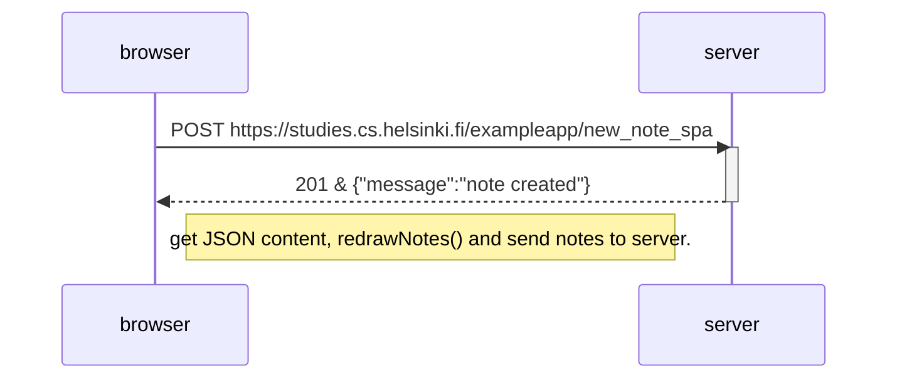

```mermaid
sequenceDiagram
    participant browser
    participant server

    browser->>server: POST https://studies.cs.helsinki.fi/exampleapp/new_note_spa
    activate server
    server-->>browser: 201 & {"message":"note created"}
    deactivate server

    Note right of browser: get JSON content, redrawNotes() and send notes to server.


```
